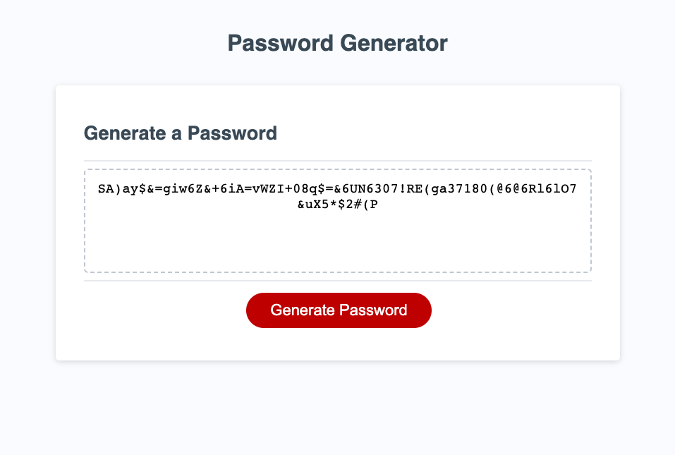

# PasswordGenerator
Password Generator created for CU Fullstack Bootcamp

The password generator allows a user to select a desired length for their password of anywhere from 8-128 characters while incorporating a random
selection of characters with customizable attributes of either uppercase, lowercase, numeric or special characters.

screenshot:  

deployed link: https://beerendan.github.io/PasswordGenerator/